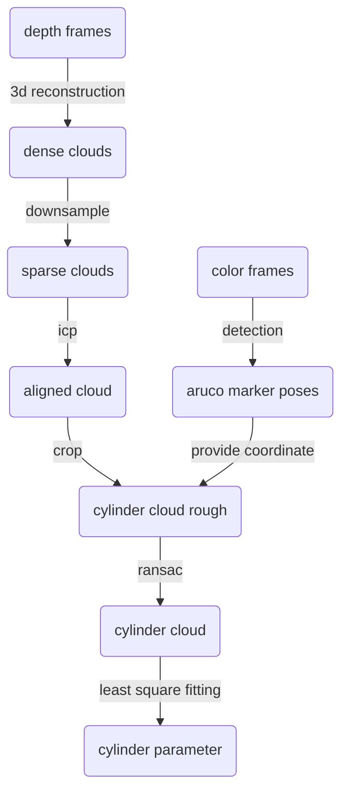

# Performance documantation of sensing algorithms

## Realsense 415 (camera held by hand)

Resolution is set to **1920*1080**. Leaf size for downsampling is set to **2mm**. Radius ground truth is **9.76mm**, which is the arithmetic average of 6 measurements.

Time used(cpu:Intel(R) Xeon(R) CPU_E3-1231 v3 @ 3.40GHz): 
- aruco marker detection: insignificant
- 3d reconstruction: 0.57s per frame (16 measurements)
- downsampling: 0.11s per frame (16 measurements)
- ICP: 3.4s per frame from second frame on (16 measurements)
- crop: insignificant
- RANSAC: insignificant
- fitting: insignificant

| Number of frames | Estimated radius |     Error     | Time used |
| :--------------: | :--------------: | :-----------: | :-------: |
|        1         |     11.25mm      | 1.49mm(15.3%) |   0.88s   |
|        4         |     11.11mm      | 1.35mm(13.8%) |  13.12s   |
|        16        |      9.59mm      | -0.17mm(1.7%) |  62.08s   |