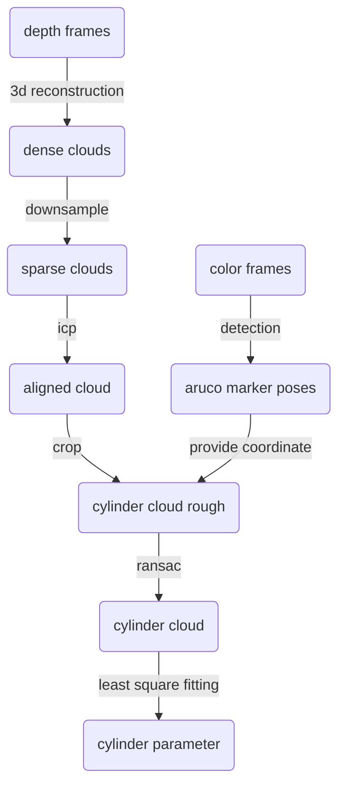
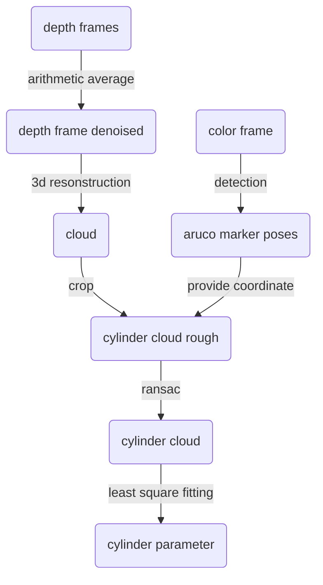

# Performance documantation of sensing algorithms

## **Realsense 415 (camera held by hand)**

Resolution is set to **1920*1080**. Leaf size for downsampling is set to **2mm**. Radius ground truth is **9.76mm**, which is the arithmetic average of 6 measurements.

Time used(cpu:Intel(R) Xeon(R) CPU_E3-1231 v3 @ 3.40GHz): 
- aruco marker detection: insignificant
- 3d reconstruction: 0.57s per frame (16 measurements)
- downsampling: 0.11s per frame (16 measurements)
- ICP: 3.4s per frame from second frame on (16 measurements)
- crop: insignificant
- RANSAC: insignificant
- fitting: insignificant

| Number of frames | Estimated radius |     Error      |
| :--------------: | :--------------: | :------------: |
|        1         |     11.25mm      | 1.49mm(15.3%)  |
|        4         |     11.11mm      | 1.35mm(13.8%)  |
|        16        |      9.59mm      | -0.17mm(1.7%)  |
|        32        |      7.63mm      | -2.13mm(21.8%) |

**Conclusion:**   
　　clouds not nicely aligned, need better icp algorithm

---

## **Realsense 415 (camera fixed on tripod)**

Same workflow, expect that ICP is no longer required.

| Number of frames | Estimated radius |     Error      |
| :--------------: | :--------------: | :------------: |
|        1         |     12.39mm      | 2.63mm(26.9%)  |
|        4         |     10.82mm      | 1.06mm(10.9%)  |
|        8         |      7.97mm      | -1.79mm(18.3%) |
|        16        |      8.64mm      | -1.12mm(11.5%) |
|        24        |      8.53mm      | -1.23mm(12.6%) |
|        32        |      8.43mm      | -1.33mm(13.6%) |

---

## **Realsense 415 (camera fixed on tripod)**

**Main difference:**  
　　Only 1 color frame is used, and multiple depth frame are taken and arithmetic average is computed for denoising. So no need for cloud registrition.

**fast:**

| Number of depth frames | Estimated radius (0-depth point excluded) |     Error     |
| :--------------------: | :---------------------------------------: | :-----------: |
|           1            |             10.72mm (10.72mm)             |               |
|           20           |             11.65mm (10.65mm)             |               |
|           40           |             11.67mm (10.36mm)             |               |
|           60           |             10.36mm (10.38mm)             |               |
|           80           |             11.21mm (14.14mm)             |               |
|          100           |             9.67mm (10.54mm)              | -0.09mm(0.9%) |

**slow:**

| Number of depth frames | Estimated radius | Error |
| :--------------------: | :--------------: | :---: |
|           1            |     10.62mm      |       |
|           20           |      9.47mm      |       |
|           40           |     10.46mm      |       |
|           60           |      7.90mm      |       |
|           80           |      9.59mm      |       |
|          100           |      7.79mm      |       |

**fast with 20mm segment(ground truth: 9.70*10.5):**

| Number of depth frames | Estimated radius | Error |
| :--------------------: | :--------------: | :---: |
|           1            |     12.83mm      |       |
|           20           |     14.08mm      |       |
|           40           |     13.38mm      |       |
|           60           |     13.50mm      |       |
|           80           |     14.58mm      |       |
|          100           |     13.40mm      |       |

**fast with 40mm segment(ground truth: 9.70*10.5):**

| Number of depth frames | Estimated radius | Error |
| :--------------------: | :--------------: | :---: |
|           1            |     10.53mm      |       |
|           20           |     12.10mm      |       |
|           40           |     11.38mm      |       |
|           60           |     11.42mm      |       |
|           80           |     11.38mm      |       |
|          100           |     11.39mm      |       |

**fast with 80mm segment(ground truth: 9.70*10.5):**

| Number of depth frames | Estimated radius | Error |
| :--------------------: | :--------------: | :---: |
|           1            |     10.53mm      |       |
|           20           |     10.50mm      |       |
|           40           |     10.57mm      |       |
|           60           |     10.48mm      |       |
|           80           |     10.27mm      |       |
|          100           |     11.22mm      |       |
